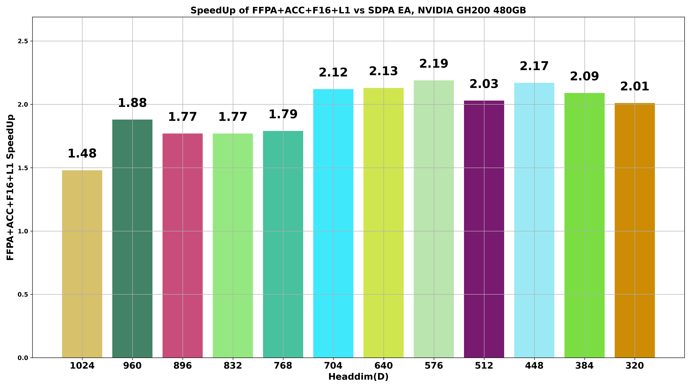
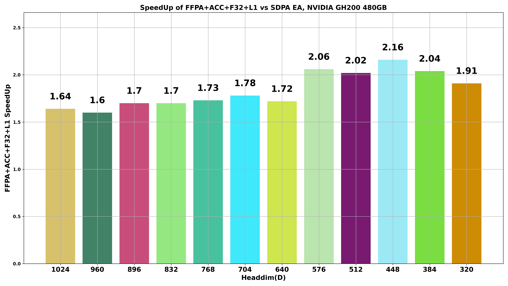
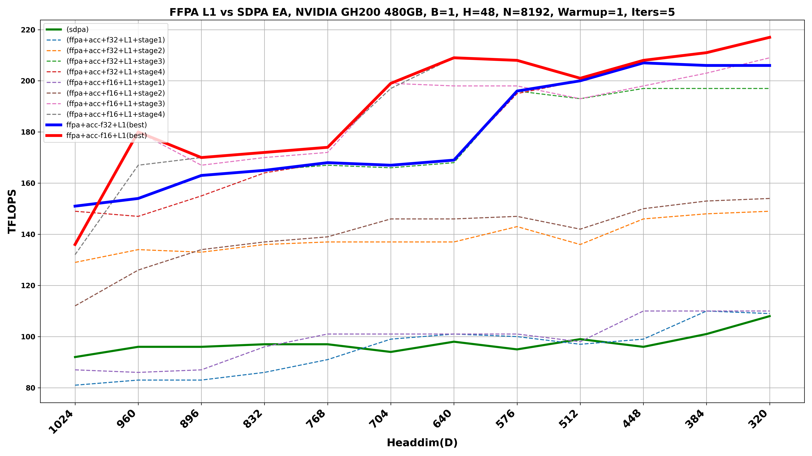

# FFPA-Attn Performance Benchmarks on Lambda.ai

This document summarizes the FFPA-Attn benchmark results which can be viewed in `ffpa-attn/tests/tmp/`.

## 1. Speedup — FFPA+ACC+F16+L1 vs SDPA EA



### Interpretation

- **Speedup increases** as D drops from 1024 → 576, peaking around **≈2.2×**.
- FFPA’s L1 design benefits most when:
  - Tensor Core tile alignment is optimal  
  - Shared memory footprint fits SM capacity  
  - Warp scheduling reaches high occupancy  
- For very small D (e.g., 320) arithmetic intensity drops and SDPA becomes more competitive.

---

## 🔵 2. Speedup — FFPA+ACC+F32+L1 vs SDPA EA



### Interpretation

- FP32 accumulation reduces peak throughput (vs F16), but still delivers **≈1.6–2.2×** speedups.
- Best region: **D ≈ 448–576** where tiling and register usage are well balanced.
- Slow-downs at the extremes:
  - Very large D → register pressure, lower occupancy  
  - Very small D → low compute/bandwidth ratio  

---

## 3. TFLOPS Comparison — FFPA L1 Variants vs SDPA EA



### Key Observations

- SDPA EA baseline sits around **90–110 TFLOPS**.
- FFPA+ACC+F16 reaches **≈180–215 TFLOPS** — the overall highest throughput.
- FFPA+ACC+F32 reaches **≈150–205 TFLOPS** — slightly lower due to FP32 accumulator overhead.
- A clear jump at **D ≈ 576**:
  - Tensor Core tiles align nicely with head dimension  
  - SMEM layout matches GH200 banking patterns  
  - Warp occupancy reaches close to the practical maximum  

---

## Why the Trends Look Like This

### ✔ GPU Architecture Factors (NVIDIA GH200 / H100)

- **Tensor Core MMA Shape Alignment**  
  Performance peaks when `D` aligns with natural tile sizes (multiples of 64, 128, 256). Misaligned `D` often wastes compute or increases padding.

- **Shared Memory Bank Swizzling**  
  FFPA uses SMEM heavily. Good swizzling/padding minimizes bank conflicts, but some `D` values still induce mild conflicts and small dips.

- **Register Pressure & Warp Occupancy**  
  Larger `D` increases per-thread register usage, which reduces the number of resident warps per SM → lower effective TFLOPS.

- **Arithmetic Intensity**  
  When `D` is small, each byte of data participates in fewer FLOPs, so attention becomes more memory-bound and SDPA closes the gap.

- **F16 vs F32 Accumulation**  
  F32 accumulation improves numerical robustness but uses more registers and bandwidth → FFPA+ACC+F32 is slightly slower than FFPA+ACC+F16.

---

<details>
<summary><strong> Installation & Benchmarking on Lambda.ai (click to expand)</strong></summary>

### 1. Connect to Lambda Instance (from Mac)

```bash
ssh ubuntu@<INSTANCE_IP>
```

Check GPU:

```bash
nvidia-smi
```

---

### 2. Sync Local Project → Cloud

From **Mac → Cloud**:

```bash
rsync -avz --progress <PATH OF FILE> ubuntu@<INSTANCE_IP>:~/ffpa-attn/
```

From **Cloud → Mac** (to bring results back):

```bash
rsync -avz --progress ubuntu@<INSTANCE_IP>:~/ffpa-attn/ <PATH OF FILE>
```

---

### 3. Create & Activate Virtual Environment (on Cloud)

```bash
cd ~/ffpa-attn
python3 -m venv .venv
source .venv/bin/activate
```

Verify you are inside the venv:

```bash
which python
which pip
```

Expected:

```text
/home/ubuntu/ffpa-attn/.venv/bin/python
/home/ubuntu/ffpa-attn/.venv/bin/pip
```

---

### 4. Install Build Dependencies

```bash
pip install --upgrade pip
pip install pybind11 packaging ninja numpy
```

---

### 5. Install PyTorch for CUDA 12.x (ARM64)

```bash
pip install torch --index-url https://download.pytorch.org/whl/cu124
```

Validate:

```bash
python -c "import torch; print(torch.__version__, torch.cuda.is_available())"
```

You should see something like:

```text
2.5.1 True
```

---

### 6. Configure CUDA Environment

```bash
export CUDA_HOME=/usr/local/cuda
export PATH="$CUDA_HOME/bin:$PATH"

which nvcc
nvcc --version
```

Expected output mentions **CUDA 12.8**.

---

### 7. Build ffpa-attn Wheel (ARM64)

From the project root:

```bash
cd ~/ffpa-attn
python setup.py bdist_wheel
```

A wheel should be generated under:

```text
dist/ffpa_attn-0.0.2.1-cp310-cp310-linux_aarch64.whl
```

---

### 8. Install the Wheel

```bash
pip install dist/ffpa_attn-*.whl
```

Verify:

```bash
pip show ffpa-attn
```

You should see something like:

```text
Name: ffpa-attn
Version: 0.0.2.1
Location: /home/ubuntu/ffpa-attn/.venv/lib/python3.10/site-packages
```

---

### 9. Run Benchmark Test

From the `ffpa-attn` directory:

```bash
cd tests && pip install matplotlib && python3 test_ffpa_attn.py --gen-bench --show-all --plot
```

This will:
- Run SDPA EA baseline
- Run FFPA L1 variants (F16/F32 accum)
- Print TFLOPS, timings, and speedups
- Optionally save plots under `tests/tmp` if `--plot` and `--gen-bench` are used.

---

### 10. Troubleshooting Notes

#### a) `pybind11/pybind11.h: No such file or directory`

```bash
pip install pybind11
```

Rebuild:

```bash
python setup.py bdist_wheel
pip install dist/ffpa_attn-*.whl
```

#### b) `no kernel image is available for execution on the device`

- Usually means the kernel was compiled for the wrong SM version.
- GH200/H100 is **sm_90** — ensure `setup.py` / NVCC flags include:

```text
-gencode arch=compute_90,code=sm_90
```

Then **clean and rebuild**:

```bash
rm -rf build dist *.egg-info
python setup.py bdist_wheel
pip install dist/ffpa_attn-*.whl
```

---

### 11. Sync Cloud Results Back to Mac

From your **Mac**:

```bash
rsync -avz --progress ubuntu@<INSTANCE_IP>:~/ffpa-attn/tests/tmp/ <PATH OF FILE>
```

This pulls the generated plots and benchmark tables back locally.

---

## Summary

- FFPA L1 significantly outperforms SDPA EA on GH200, with **≈2× speedups** in the best regions of `D`.
- FFPA+ACC+F16 is the fastest path; FFPA+ACC+F32 offers a good trade-off between numerical stability and throughput.
- The installation and benchmarking flow on Lambda.ai is now fully scripted and reproducible via this README.
